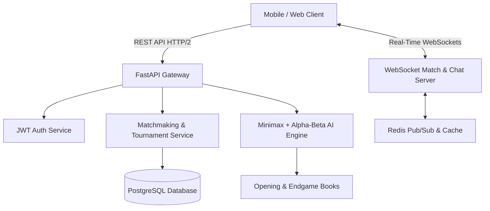

# ChessX Documentation Suite (Version 1.0)

Welcome to the official, comprehensive technical and architectural documentation suite for **ChessX (Version 1.0)** — a modern, high-performance, cross-platform chess application powered by a custom chess engine, real-time multiplayer WebSockets, a FastAPI backend, and an intelligent Minimax/Alpha-Beta AI system.

---

## 📚 Documentation Volumes Overview

This documentation is organized into 10 core volumes plus an exhaustive technical appendix:

| Volume | Title | Summary & Key Topics | Link |
| :--- | :--- | :--- | :--- |
| **Vol 1** | **Project Foundation** | Executive summary, vision statement, functional/non-functional requirements, tech stack, competitor matrix, & roadmap. | [Volume 1: Project Foundation](file:///d:/chess%20project/docs/Volume_01_Project_Foundation.md) |
| **Vol 2** | **UI/UX Design** | Detailed design specifications for all 16 app screens including wireframes, user flows, accessibility (WCAG 2.1 AA), typography, & color palettes. | [Volume 2: UI/UX Design](file:///d:/chess%20project/docs/Volume_02_UI_UX_Design.md) |
| **Vol 3** | **Chess Engine** | Core rules engine, bitboard state representation, move generation algorithms, special moves (castling, en passant, promotion), state history, & PGN engine. | [Volume 3: Chess Engine](file:///d:/chess%20project/docs/Volume_03_Chess_Engine.md) |
| **Vol 4** | **Graphics, VFX & Audio** | Custom board/piece themes, particle systems (fire, lightning, confetti), screen animations, piece drag physics, & spatial audio design. | [Volume 4: Graphics & Audio](file:///d:/chess%20project/docs/Volume_04_Graphics_Animations_Audio.md) |
| **Vol 5** | **Backend Architecture** | FastAPI microservices architecture, folder layout, JWT auth, WebSocket gateway, rate limiting, logging, & middleware layers. | [Volume 5: Backend](file:///d:/chess%20project/docs/Volume_05_Backend.md) |
| **Vol 6** | **Database Design** | Relational database schema, ER Diagrams, 11 core tables, indexing strategies, constraints, & SQL sample queries. | [Volume 6: Database Design](file:///d:/chess%20project/docs/Volume_06_Database_Design.md) |
| **Vol 7** | **AI System** | Minimax search algorithm, Alpha-Beta pruning, Piece-Square positional evaluation, opening books, & difficulty level scaling. | [Volume 7: AI System](file:///d:/chess%20project/docs/Volume_07_AI_System.md) |
| **Vol 8** | **Multiplayer** | Elo-based matchmaking engine, WebSocket synchronization, reconnection handling, in-game chat, & anti-cheat heuristics. | [Volume 8: Multiplayer](file:///d:/chess%20project/docs/Volume_08_Multiplayer.md) |
| **Vol 9** | **Testing & QA** | Unit, integration, E2E, WebSocket stress testing, OWASP security auditing, bug tracking lifecycle, & UAT acceptance matrix. | [Volume 9: Testing](file:///d:/chess%20project/docs/Volume_09_Testing.md) |
| **Vol 10** | **Deployment & Maintenance** | CI/CD pipelines, Docker containerization, mobile Android/iOS build targets, database migration strategies, & disaster recovery. | [Volume 10: Deployment](file:///d:/chess%20project/docs/Volume_10_Deployment_Maintenance.md) |
| **Appx** | **Additional Appendix** | OpenAPI specification, full SQL DDL, project folder structures, coding standards, Git workflow, design tokens, & 3rd-party license audit. | [Appendix](file:///d:/chess%20project/docs/Volume_11_Appendix.md) |

---

## 🚀 Key Architecture Highlights

---

## 🛠️ Quick System Reference

- **Frontend Tech Stack**: Cross-Platform Application (Mobile/Web), HTML5/CSS3/JavaScript / Flutter framework option, Canvas/WebGL rendering.
- **Backend Tech Stack**: Python 3.11+, FastAPI, AsyncIO, WebSockets, Uvicorn/Gunicorn.
- **Data Persistence**: PostgreSQL 15, Redis 7 (Caching, Session Store & Pub/Sub), Alembic (Migrations).
- **AI Core**: Native C++/Python binding engine implementing Bitboard evaluation, Transposition tables, and Minimax with Alpha-Beta pruning.

---

*Document Version: 1.0.0*  
*Last Updated: July 20, 2026*  
*Author: DeepMind Antigravity Engineering Team*
