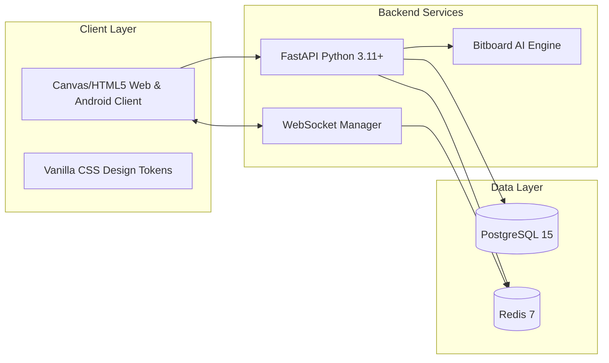
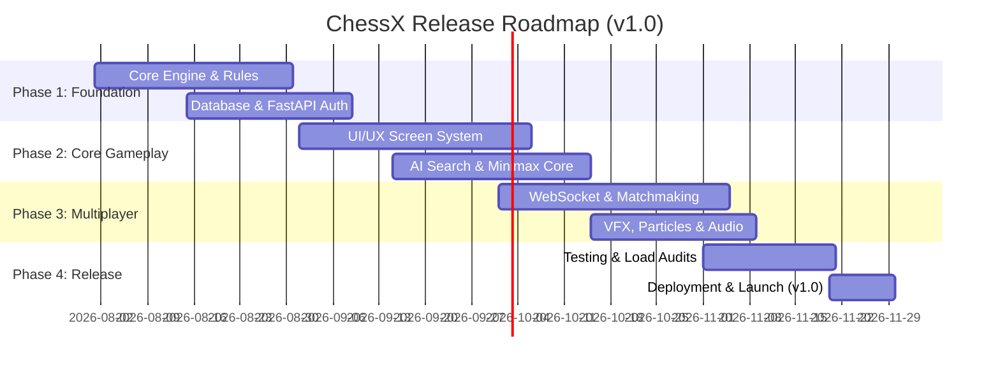

# Volume 1 – Project Foundation

> **ChessX Technical & Design Documentation**  
> **Document Version:** 1.0.0  
> **Status:** Approved Specification  

---

## 1. Executive Summary

**ChessX** is an next-generation, high-performance digital chess platform engineered to bridge the gap between casual multiplayer gaming and competitive chess analysis. Built upon a modern decoupled architecture featuring a FastAPI backend, real-time WebSocket state synchronizer, custom C++/Python bitboard engine, and high-fidelity client graphics, ChessX delivers latency-free multiplayer, adaptive AI opponents, comprehensive match analytics, and rich visual customization.

---

## 2. Vision Statement

To create the premier open-architecture chess platform that empowers players of all skill levels through intuitive UI/UX design, real-time responsive gameplay, deep tactical AI insights, and vibrant visual effects.

---

## 3. Project Objectives

1. **Sub-50ms Latency**: Deliver instantaneous board state synchronization for real-time online matchmaking and blitz/bullet time controls.
2. **Adaptive AI Engine**: Provide a scalable AI opponent ranging from Elo 800 (casual beginner) to Elo 2800+ (Grandmaster level) with zero external cloud dependencies.
3. **Immersive Audio-Visual Experience**: Elevate standard chess graphics through customizable 2D/3D board themes, particle effects (glow, fire, lightning), dynamic animations, and spatial sound design.
4. **Cross-Platform Accessibility**: Guarantee seamless accessibility on web and mobile devices with full WCAG 2.1 AA accessibility compliance.
5. **Robust Security & Fair Play**: Implement real-time anti-cheat detection, encrypted WebSocket communications, and strict JWT authentication.

---

## 4. Problem Statement

Existing digital chess platforms often suffer from one or more of the following drawbacks:
- **Outdated UI/UX**: Overly rigid, unintuitive, or visually dated interfaces that fail to engage modern gaming audiences.
- **High Network Jitter & Desync**: Clunky WebSocket sync leading to clock drift or dropped moves during rapid time controls.
- **Monolithic & Proprietary Engines**: Opaque AI behavior lacking dynamic difficulty scaling or user-customizable visual board setups.
- **Inadequate Offline/Mobile Support**: Poor performance on lower-tier mobile hardware and inadequate offline match play options.

ChessX resolves these issues by pairing an ultra-lightweight client rendering engine with a optimized backend service layer and flexible, responsive client design.

---

## 5. Scope

### In-Scope (Version 1.0)
- Single-player AI matches (Minimax + Alpha-Beta pruning, 10 difficulty levels).
- 1v1 Real-time Online Multiplayer via WebSockets.
- Matchmaking queues (Casual & Ranked Elo rating system).
- Tournament management (Single Elimination, Swiss System).
- Complete Chess Rules Engine (Castling, En Passant, Promotion, Draw conditions, PGN import/export, Move history undo/redo).
- Screen & Piece customization (4 Board themes, 3 Piece sets, Particle VFX toggle).
- Comprehensive User Profiles, Statistics, Leaderboards, and Friend lists.
- FastAPI backend, PostgreSQL relational database, and Redis caching/pub-sub layer.

### Out-of-Scope (Future Releases - v2.0+)
- Native iOS App Store deployment (Planned for v2.0; Web & Android first in v1.0).
- Live commentary streaming integrations (Twitch/YouTube API integrations).
- Variant chess modes (3D Chess, Bughouse, Crazyhouse, Chess960).

---

## 6. Features Matrix

| Feature Module | Description | Target Users |
| :--- | :--- | :--- |
| **Play vs AI** | Play against scalable AI (Elo 800 - 2800) with custom hint engine. | Casual & Competitive Players |
| **Online Matchmaking** | Auto-matchmaking based on Glicko-2 / Elo rating brackets. | All Players |
| **Private Matches** | Invite friends via custom room codes or direct friend invites. | Casual Players |
| **Tournaments** | Join or create real-time Swiss and Knockout tournaments. | Competitive Players |
| **Interactive Analysis** | Load PGN files, analyze blunder points, and replay past matches. | Analysts & Student Players |
| **Custom Themes & VFX** | Switch board textures (Wood, Glass, Marble, Cyberpunk) and visual FX. | All Players |
| **Live Chat & Emotes** | In-game real-time chat with moderated emoji reactions. | Online Competitors |

---

## 7. User Personas

### Persona A: Casual Charlie (Beginner / Elo 900)
- **Background**: Plays chess casually on phone during commutes.
- **Goals**: Quick matches, fun visual themes, forgiving undo features against AI.
- **Pain Points**: Intimidated by complex chess notation and strict grandmaster clocks.

### Persona B: Competitive Claire (Advanced / Elo 1900)
- **Background**: Competes in online tournaments and local club events.
- **Goals**: Zero lag in bullet matches (1+0), accurate Elo tracking, precise move history exported to PGN.
- **Pain Points**: Desynchronization errors, unfair play/cheating, clunky analysis boards.

### Persona C: Admin Alex (Platform Administrator)
- **Background**: Manages community operations and server health.
- **Goals**: Real-time user management, handling user reports, monitoring WebSocket connection health and server load.
- **Pain Points**: Lack of actionable logging, slow database query execution during peak tournament hours.

---

## 8. Functional Requirements

- **FR-01 (Authentication)**: System shall support email/password registration, login, JWT token issuance, and password recovery.
- **FR-02 (Board State)**: System shall maintain FEN (Forsyth-Edwards Notation) strings representing exact board configurations after every move.
- **FR-03 (Rule Enforcement)**: System shall enforce legal moves strictly according to FIDE official rules, rejecting illegal moves instantly.
- **FR-04 (Clock Synchronization)**: Backend shall maintain authoritative match clocks to prevent local client clock tampering.
- **FR-05 (AI Decisioning)**: AI service must compute moves within specified difficulty time budgets (< 1000ms for max depth).
- **FR-06 (PGN Engine)**: System shall allow importing valid PGN notation and exporting finished match records to `.pgn` files.
- **FR-07 (Leaderboard)**: System shall update global Elo rankings automatically upon match completion.

---

## 9. Non-Functional Requirements

- **NFR-01 (Performance)**: WebSocket message delivery latency must remain under 50ms for 99% of requests.
- **NFR-02 (Scalability)**: Backend must handle up to 10,000 concurrent WebSocket connections per instance node.
- **NFR-03 (Availability)**: Core API and matchmaking services must achieve 99.9% uptime.
- **NFR-04 (Security)**: All client-server HTTP communications must run over HTTPS (TLS 1.3) and WebSockets over WSS. Passwords must be hashed using Argon2id.
- **NFR-05 (Accessibility)**: User interface must comply with WCAG 2.1 Level AA, supporting high contrast mode and screen reader navigation tags.
- **NFR-06 (Usability)**: First-time users should be able to initiate a match against AI within 2 clicks from the homepage.

---

## 10. Technology Stack

- **Frontend**: HTML5, Vanilla CSS3 (Design Tokens), JavaScript / Canvas API & WebGL rendering.
- **Backend API**: Python 3.11+, FastAPI, Pydantic v2, AsyncIO.
- **Real-Time Layer**: WebSockets, Redis Pub/Sub.
- **Database Layer**: PostgreSQL 15 (ORM: SQLAlchemy 2.0 / asyncpg), Redis 7 (Caching, Session Store).
- **AI Engine**: Python C-Extension / Native C++ engine with Bitboards, Minimax, Alpha-Beta pruning, Piece-Square Tables.

---

## 11. Competitor Analysis

| Feature | ChessX | Chess.com | Lichess |
| :--- | :--- | :--- | :--- |
| **Open Architecture** | Yes (Modular FastAPI) | No (Proprietary Monolith/Microservices) | Yes (Scala/Lila) |
| **Custom VFX & Audio** | Advanced (Particle fire, lightning, 3D wood) | Basic 2D/3D themes | Minimalist 2D themes |
| **AI Customization** | Dynamic Elo (800-2800) + custom hints | Stockfish levels | Stockfish / Fairy-Stockfish |
| **Real-time Latency** | Ultra-low (<50ms over WSS) | Low (50-120ms) | Ultra-low (<40ms) |
| **Licensing** | Open Source / Custom Commercial | Proprietary | Open Source (AGPLv3) |

---

## 12. Development Roadmap & Timelines

---

*End of Volume 1 – Project Foundation*
