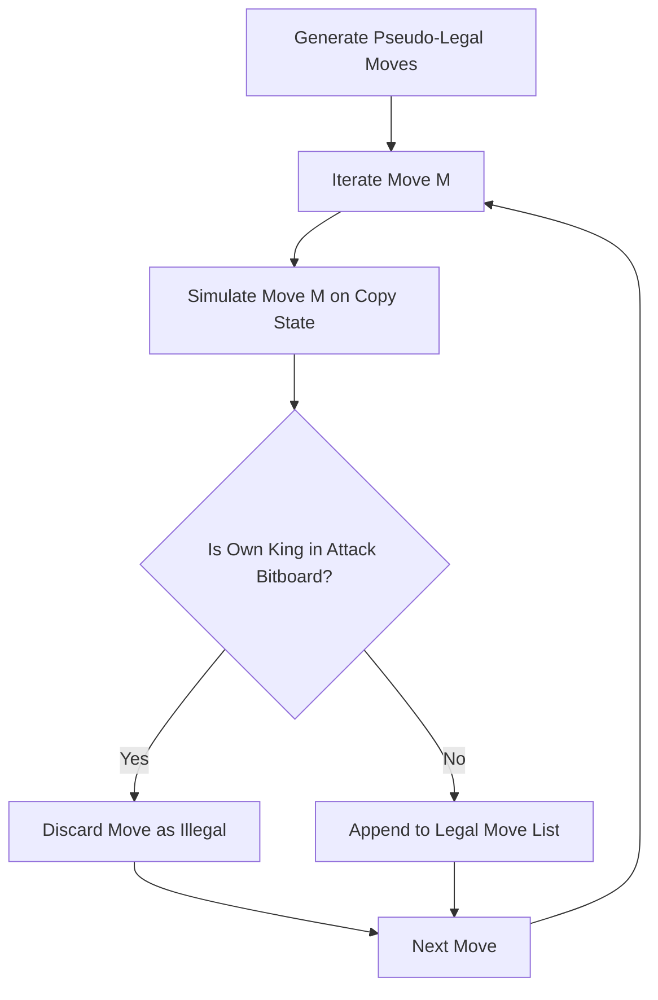

# Volume 3 – Chess Engine

> **ChessX Technical & Design Documentation**  
> **Document Version:** 1.0.0  
> **Status:** Approved Specification  

---

## 1. Board Representation

ChessX implements a high-performance **Bitboard (64-bit integer array)** board representation alongside a 1D Array cache for fast O(1) piece lookup.

### 1.1 Bitboard Architecture
Each piece type for White and Black is assigned a 64-bit unsigned integer (`uint64_t` / Python `int`), where bit index $N$ represents square $N$ on the chessboard ($N = \text{rank} \times 8 + \text{file}$):

```
Square Indexing Mapping:
 8 | 56 57 58 59 60 61 62 63
 7 | 48 49 50 51 52 53 54 55
 6 | 40 41 42 43 44 45 46 47
 5 | 32 33 34 35 36 37 38 39
 4 | 24 25 26 27 28 29 30 31
 3 | 16 17 18 19 20 21 22 23
 2 |  8  9 10 11 12 13 14 15
 1 |  0  1  2  3  4  5  6  7
   -------------------------
      a  b  c  d  e  f  g  h
```

- **Bitboards Array**:
  - `Pawn_W`, `Knight_W`, `Bishop_W`, `Rook_W`, `Queen_W`, `King_W`
  - `Pawn_B`, `Knight_B`, `Bishop_B`, `Rook_B`, `Queen_B`, `King_B`
  - `Occupied_W` = Bitwise OR of all White piece bitboards.
  - `Occupied_B` = Bitwise OR of all Black piece bitboards.
  - `Occupied_All` = `Occupied_W | Occupied_B`
  - `Empty_Squares` = `~Occupied_All`

---

## 2. Piece Classes & Data Structures

```python
class PieceType(Enum):
    PAWN = 1
    KNIGHT = 2
    BISHOP = 3
    ROOK = 4
    QUEEN = 5
    KING = 6

class Color(Enum):
    WHITE = 0
    BLACK = 1

class Piece:
    __slots__ = ('piece_type', 'color')
    def __init__(self, piece_type: PieceType, color: Color):
        self.piece_type = piece_type
        self.color = color

class Move:
    __slots__ = ('from_sq', 'to_sq', 'piece', 'captured_piece', 'promotion_piece', 'is_castling', 'is_en_passant')
    def __init__(self, from_sq: int, to_sq: int, piece: Piece, captured_piece: Optional[Piece] = None, promotion_piece: Optional[PieceType] = None, is_castling: bool = False, is_en_passant: bool = False):
        self.from_sq = from_sq
        self.to_sq = to_sq
        self.piece = piece
        self.captured_piece = captured_piece
        self.promotion_piece = promotion_piece
        self.is_castling = is_castling
        self.is_en_passant = is_en_passant
```

---

## 3. Move Generator

The Move Generator operates in pseudo-legal mode first, then filters moves against king safety constraints to output purely **legal moves**.

### 3.1 Pseudo-Legal Generation
- **Knights & Kings**: Pre-calculated lookup attack tables based on square index delta offsets (e.g. Knight offsets: `+17, +15, +10, +6, -6, -10, -15, -17`).
- **Pawns**: Single push (`+8` White, `-8` Black), double push from rank 2/7 (`+16` White, `-16` Black if path unblocked), diagonal captures (`+7, +9` White, `-7, -9` Black), en passant targets.
- **Sliding Pieces (Bishops, Rooks, Queens)**: Ray-casting bitwise masking with pre-calculated Magic Bitboards for instant occupancy ray lookup.

---

## 4. Legal Move Validation & Rules Engine



### 4.1 Capturing & Board State Mutation
When a move captures an opponent piece:
1. Target square bit is unset in corresponding opponent piece bitboard.
2. Target square bit is unset in opponent occupied bitboard.
3. Piece is appended to `captured_pieces_history` stack for Undo support.

---

## 5. Special Moves Engine Specifications

### 5.1 Castling Rules & Validation
Castling is legal if and only if:
1. King and target Rook have not moved previously in the match (`castling_rights` bitmask check).
2. Squares between King and Rook are completely empty (`Occupied_All & mask == 0`).
3. King is not currently in Check.
4. Squares the King passes through or lands on are not under attack by opponent pieces.

- **Kingside Castling (e1 -> g1 / e8 -> g8)**: Rook moves f1 / f8.
- **Queenside Castling (e1 -> c1 / e8 -> c8)**: Rook moves d1 / d8.

### 5.2 En Passant
En Passant capture is enabled for 1 ply immediately following a 2-square pawn jump:
- `en_passant_target_sq` is set to the skipped square (e.g., e3 when White plays e2 -> e4).
- If an opposing pawn attacks `en_passant_target_sq`, En Passant move is generated.
- On execution, captured pawn (located 1 rank behind target square) is removed from board.

### 5.3 Pawn Promotion
When a pawn reaches rank 8 (White) or rank 1 (Black):
- `Move.promotion_piece` must specify target promotion type (`QUEEN`, `ROOK`, `BISHOP`, `KNIGHT`).
- Pawn bitboard bit is cleared on target square, and selected piece bitboard bit is set.

---

## 6. Game End & Draw Conditions

### 6.1 Check & Checkmate
- **Check**: Defined when the square containing the active side's King intersects with the attack bitboard mask of the opposing side.
- **Checkmate**: King is in Check **AND** count of legal moves available to active side equals zero (`len(get_legal_moves()) == 0`).

### 6.2 Stalemate
- King is **NOT** in Check **AND** count of legal moves available to active side equals zero. Game ends immediately in a Draw (0.5 - 0.5).

### 6.3 Draw Rules Engine
1. **50-Move Rule**: Game drawn if 50 consecutive moves occur without a pawn move or piece capture (`halfmove_clock >= 100`).
2. **Threefold Repetition**: Game drawn if identical board position (FEN including castling rights & active turn) occurs 3 times in state history stack.
3. **Insufficient Material**: Automatically triggers draw if remaining pieces on board match:
   - King vs King
   - King + Bishop vs King
   - King + Knight vs King
   - King + Bishop vs King + Bishop (Bishops on same square color)

---

## 7. State History & Undo / Redo System

The board engine maintains a full state stack to guarantee instantaneous Undo/Redo:

```python
class BoardStateHistory:
    def __init__(self):
        self.move_stack: List[Move] = []
        self.fen_stack: List[str] = []
        self.castling_rights_stack: List[int] = []
        self.en_passant_stack: List[Optional[int]] = []
        self.halfmove_stack: List[int] = []

    def push(self, move: Move, fen: str, castling: int, ep: Optional[int], halfmove: int):
        self.move_stack.append(move)
        self.fen_stack.append(fen)
        self.castling_rights_stack.append(castling)
        self.en_passant_stack.append(ep)
        self.halfmove_stack.append(halfmove)

    def pop(self) -> Tuple[Move, str, int, Optional[int], int]:
        return (
            self.move_stack.pop(),
            self.fen_stack.pop(),
            self.castling_rights_stack.pop(),
            self.en_passant_stack.pop(),
            self.halfmove_stack.pop()
        )
```

---

## 8. PGN Import / Export & Replay Engine

### 8.1 PGN Parser & Exporter
The ChessX PGN subsystem converts raw SAN (Standard Algebraic Notation, e.g., `1. e4 e5 2. Nf3 Nc6 3. Bb5 a6`) into structured FEN sequence lists and vice versa.

- **Import Workflow**:
  1. Parse header metadata (`[Event "..."]`, `[White "..."]`, `[Result "..."]`).
  2. Tokenize SAN move strings.
  3. Validate SAN against current legal move list step-by-step.
  4. Generate array of full board states for interactive replay.

- **Export Workflow**:
  1. Iterate `move_stack`.
  2. Format SAN move string using piece letter, destination square, capture symbol (`x`), check (`+`), or mate (`#`).
  3. Write standardized `.pgn` string file payload.

---

## 9. Time Control Clocks

ChessX supports four clock modes with millisecond precision:

1. **Sudden Death**: Fixed time allocation per player (e.g. 5 minutes total).
2. **Fischer Increment**: Initial time + bonus seconds added per completed move (e.g. 3 min + 2s increment per move `3+2`).
3. **Delay Clock**: Countdown clock waits $D$ delay seconds before deducting main time.
4. **Overtime / Multi-period**: Time added after completing move thresholds (e.g. +30 minutes at Move 40).

- **Server-Side Authoritative Clock**: To eliminate client latency exploitation, server computes time spent per ply using server timestamp deltas:
$$\Delta t = t_{\text{server\_received}} - t_{\text{server\_last\_move}}$$
If player main time reaches $\le 0$, server triggers `TIME_OUT` event and awards victory to opponent.

---

*End of Volume 3 – Chess Engine*
