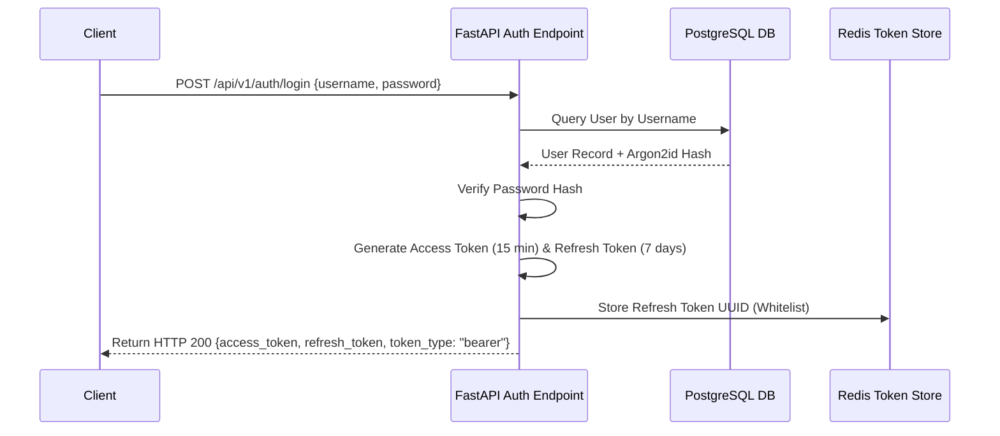

# Volume 5 – Backend Architecture

> **ChessX Technical & Design Documentation**  
> **Document Version:** 1.0.0  
> **Status:** Approved Specification  

---

## 1. FastAPI Architecture & Service Layout

ChessX backend is engineered as an asynchronous, microservice-ready modular application powered by **Python 3.11+**, **FastAPI**, **AsyncIO**, **SQLAlchemy 2.0 (asyncpg)**, and **Redis 7**.

```
chessx_backend/
├── app/
│   ├── api/
│   │   ├── v1/
│   │   │   ├── endpoints/
│   │   │   │   ├── auth.py
│   │   │   │   ├── users.py
│   │   │   │   ├── matches.py
│   │   │   │   ├── ai.py
│   │   │   │   ├── leaderboard.py
│   │   │   │   └── notifications.py
│   │   │   └── api_router.py
│   ├── core/
│   │   ├── config.py
│   │   ├── security.py
│   │   ├── database.py
│   │   ├── redis.py
│   │   └── rate_limiter.py
│   ├── db/
│   │   ├── base.py
│   │   ├── models/
│   │   └── repositories/
│   ├── engine/
│   │   ├── bitboard.py
│   │   ├── movegen.py
│   │   ├── minimax.py
│   │   └── evaluator.py
│   ├── schemas/
│   │   ├── user.py
│   │   ├── match.py
│   │   └── websocket.py
│   ├── services/
│   │   ├── auth_service.py
│   │   ├── match_service.py
│   │   ├── ai_service.py
│   │   ├── websocket_manager.py
│   │   └── notification_service.py
│   └── main.py
├── alembic/
├── tests/
└── requirements.txt
```

---

## 2. Authentication & JWT Security Pipeline

Authentication relies on **OAuth2 with Password Bearer** flow using signed **JSON Web Tokens (JWT)**.



- **Password Hashing**: Argon2id via `passlib[argon2]` with parameter defaults (Time cost: 3, Memory cost: 65536 KiB, Parallelism: 4).
- **JWT Signature**: HMAC-SHA256 with 256-bit rotating secret key.
- **Token Invalidation**: Refresh tokens stored in Redis with TTL. Blacklisting on Logout deletes Redis token key instantly.

---

## 3. Core Micro-Services Breakdown

### 3.1 User Management Service (`users.py` / `auth_service.py`)
- Profile CRUD operations, avatar image upload processing (resizing to 256x256 WebP via PIL), bio updates, privacy settings.
- Win/Loss/Draw statistics aggregation and Elo history updates.

### 3.2 Match Service (`matches.py` / `match_service.py`)
- Game session lifecycle management: `CREATE`, `JOIN`, `ABORT`, `RESIGN`, `MOVE`, `COMPLETE`.
- Persists move history FEN records to PostgreSQL asynchronously after every validated ply.

### 3.3 AI Service (`ai.py` / `ai_service.py`)
- Asynchronous wrapper for internal Python/C++ Minimax search engine.
- Offloads intensive search computations to worker threads (`asyncio.to_thread`) to maintain zero blocking on FastAPI event loop.

### 3.4 WebSocket Multiplayer Gateway (`websocket_manager.py`)
- Maintains active in-memory connection registry mapping `user_id` -> `WebSocket`.
- Coordinates real-time game state broadcasts between matched opponents:

```python
class ConnectionManager:
    def __init__(self):
        self.active_connections: Dict[str, WebSocket] = {}
        self.room_subscriptions: Dict[str, Set[str]] = defaultdict(set)

    async def connect(self, websocket: WebSocket, user_id: str, room_id: str):
        await websocket.accept()
        self.active_connections[user_id] = websocket
        self.room_subscriptions[room_id].add(user_id)

    async def broadcast_to_room(self, room_id: str, message: dict):
        for user_id in self.room_subscriptions.get(room_id, []):
            ws = self.active_connections.get(user_id)
            if ws:
                await ws.send_json(message)
```

---

## 4. Middleware, Rate Limiting & Security Layers

### 4.1 Redis Rate Limiting Middleware
Applies Token Bucket algorithm over Redis to protect API endpoints against DDoS and abuse:
- **Public Endpoints (`/login`, `/register`)**: Max 10 requests / minute per IP.
- **Game Move WebSockets**: Max 30 moves / second per connection.
- **General REST Endpoints**: Max 100 requests / minute per authenticated user.

### 4.2 Security Headers Middleware
- `Content-Security-Policy`: Restricts inline scripts & external frame embedding.
- `Strict-Transport-Security`: `max-age=31536000; includeSubDomains`.
- `X-Frame-Options`: `DENY`.
- `X-Content-Type-Options`: `nosniff`.

---

## 5. Caching & Database Performance Layer

- **SQLAlchemy 2.0 Async Session**: Uses `asyncpg` driver pool (Min connections: 10, Max connections: 50).
- **Redis Caching Strategy**:
  - Global Leaderboard Top 100 cached in Redis Sorted Set (`ZADD leaderboard_blitz elo user_id`) with 60-second invalidation TTL.
  - Active match states cached in Redis Hashes (`HSET match:{id} fen {fen_string}`) for instant WebSocket access without hitting DB per move.

---

## 6. Structured Logging & Exception Handling

- **Logging**: Powered by `structlog` outputting JSON formatted logs for ELK / Grafana Loki parsing:
```json
{
  "timestamp": "2026-07-20T11:49:58Z",
  "level": "info",
  "event": "move_executed",
  "match_id": "8f3b21a0-7b4a-4e2a",
  "user_id": "usr_9912",
  "move_san": "Nf3",
  "ply_time_ms": 142
}
```
- **Global Error Handling**: Custom FastAPI `HTTPException` handlers mapping engine exceptions (e.g. `IllegalMoveError`, `InvalidFENError`, `RoomFullError`) to clean JSON error payloads:

```json
{
  "error_code": "ILLEGAL_MOVE",
  "message": "Move Nf3 places white king in check from bishop on c5.",
  "timestamp": "2026-07-20T11:50:00Z"
}
```

---

*End of Volume 5 – Backend Architecture*
