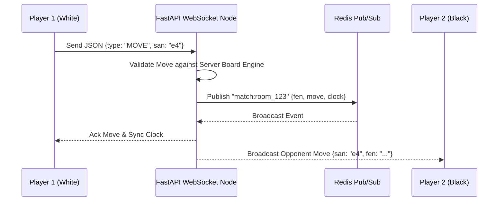

# Volume 8 – Multiplayer & WebSockets

> **ChessX Technical & Design Documentation**  
> **Document Version:** 1.0.0  
> **Status:** Approved Specification  

---

## 1. Real-Time Multiplayer Architecture

Multiplayer in ChessX relies on persistent **WebSockets (WSS)** managed by FastAPI and backboned by **Redis Pub/Sub** for cross-server node broadcasting.



---

## 2. Matchmaking Engine

The Matchmaking engine matches players in real-time based on their Glicko-2 / Elo ratings using dynamic rating tolerance expansion:

$$\text{Rating Window} = [\text{Elo}_{\text{player}} - \Delta R(t), \quad \text{Elo}_{\text{player}} + \Delta R(t)]$$

where $\Delta R(t) = 50 + 15 \times t_{\text{seconds in queue}}$.

- **Matchmaking Queue**: Redis Sorted Sets per time control (`queue:blitz`, `queue:bullet`, `queue:rapid`).
- **Match Formation**: When two players fall within each other's expanding rating window, the engine pops both from the queue, creates a new game record in PostgreSQL, assigns colors randomly (or balanced based on color history), and transmits a `MATCH_FOUND` WebSocket payload containing room ID.

---

## 3. Friend System & Private Room Invitations

- **Friend System**: Instant online status presence via Redis (`HSET user_status user_123 "ONLINE"`).
- **Private Direct Invites**: Players can generate 6-character room codes (e.g., `CX-94A2`). Entering the code subscribes the joining player to the match room instant queue.

---

## 4. WebSocket Synchronization & Network Drop Reconnection

### 4.1 Message Frame Protocol

```json
{
  "type": "MOVE",
  "game_id": "b11ebc99-9c0b-4ef8-bb6d-6bb9bd380a22",
  "sender_id": "a0eebc99-9c0b-4ef8-bb6d-6bb9bd380a11",
  "payload": {
    "from": "e2",
    "to": "e4",
    "promotion": null,
    "client_timestamp": 1784548200120
  }
}
```

### 4.2 Reconnection Protocol
If network connectivity drops during an active match:
1. Client WebSocket fires `onclose` event and initiates exponential backoff reconnect retries (1s, 2s, 4s, 8s).
2. Server holds match state in grace period for 45 seconds while pausing main clock or running disconnect countdown.
3. Upon reconnection with JWT auth header, server sends `SYNC_STATE` payload containing current full FEN, move history stack, and authoritative remaining clock times.

---

## 5. In-Game Chat System

- Moderated text chat with profanity regex filtering and rate limiting (max 1 message per 2 seconds).
- Preset emote reactions (e.g. "Good luck!", "Nice move!", "Well played!") transmitted as lightweight JSON enum frames.

---

## 6. Anti-Cheat & Fair Play Engine

To preserve competitive integrity, ChessX integrates automated real-time anti-cheat heuristics:

1. **Move Timing Anomaly Detection**: Tracks move execution speed variance. Uniform move delays (e.g. exactly 2.1 seconds per move regardless of position complexity) flag a potential engine usage signal.
2. **Engine Correlation Analysis**: Post-match pipeline compares player moves against Stockfish top-choice moves. Moves matching 95%+ top Stockfish recommendations across complex tactical positions trigger automated account review flags.
3. **Focus State Detection**: Client reports tab focus loss events during active ranked matches.

---

*End of Volume 8 – Multiplayer & WebSockets*
