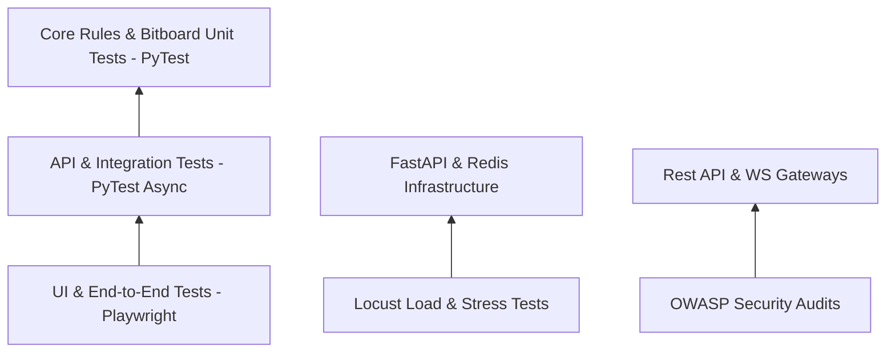

# Volume 9 – Testing & Quality Assurance

> **ChessX Technical & Design Documentation**  
> **Document Version:** 1.0.0  
> **Status:** Approved Specification  

---

## 1. Testing Strategy Matrix

Quality assurance in ChessX spans multi-layer automated test suites across unit, integration, UI, load, and security testing layers:



---

## 2. Unit Testing Suite (`pytest`)

Unit tests target isolated backend modules, bitboard move generators, and mathematical utility functions.

- **Coverage Goal**: > 90% code coverage.
- **Key Modules Tested**:
  - `test_movegen.py`: Validates legal move count for standard test positions (Perft benchmarks).
  - `test_castling.py`: Verifies castling validation under pins, occupied squares, and enemy attacks.
  - `test_san_parser.py`: Verifies PGN SAN string parsing and FEN serialization.

```python
def test_perft_initial_position():
    board = Board() # Default starting FEN
    assert perft(board, depth=1) == 20
    assert perft(board, depth=2) == 400
    assert perft(board, depth=3) == 8902
```

---

## 3. Integration & API Testing

Integration tests run against a test PostgreSQL database and Redis instance using `httpx.AsyncClient`.

- **API Endpoint Tests**:
  - Auth registration, login token issuance, expired token rejection.
  - Profile retrieval, statistics updating, leaderboard queries.
- **WebSocket Gateway Tests**:
  - Simulates 2 connected WebSocket clients executing moves sequentially.
  - Verifies turn enforcement (Black cannot move on White's turn).

---

## 4. UI & End-to-End (E2E) Testing (`Playwright`)

Automated browser tests execute in headless Chromium, Firefox, and WebKit browsers:

1. **User Authentication Flow**: Register new user -> Redirect to Dashboard -> Assert session state.
2. **AI Match Flow**: Navigate to AI selection -> Set Level 5 -> Play 5 moves -> Request Hint -> Assert board state.
3. **Responsive Design Verification**: Validates layout rendering at 375px (Mobile), 768px (Tablet), 1440px (Desktop).

---

## 5. Performance & Load Testing (`Locust`)

Stress testing measures platform throughput under extreme concurrent user loads:

- **Target Capacity**: 10,000 concurrent WebSocket connections.
- **Target Load Metric**: 500 move executions / second.
- **SLA Thresholds**:
  - REST API response time $P_{95} < 100\text{ms}$.
  - WebSocket move broadcast latency $P_{99} < 50\text{ms}$.
  - Error rate under maximum load $< 0.1\%$.

---

## 6. Security Testing & Vulnerability Scans

- **SAST (Static Application Security Testing)**: Scans codebase using `Bandit` and `Semgrep` for Python security flaws.
- **Dependency Auditing**: `safety check` and `pip-audit` integrated into CI/CD pipeline to block vulnerable packages.
- **OWASP Security Audit**:
  - SQL Injection prevention via SQLAlchemy parameterized queries.
  - XSS prevention via HTML output sanitization.
  - CSRF protection via SameSite cookies & JWT headers.

---

## 7. Bug Tracking Lifecycle & UAT Matrix

```
[ New Issue ] --> [ Triaged ] --> [ In Progress ] --> [ Code Review ] --> [ Verified ] --> [ Closed ]
```

- **User Acceptance Testing (UAT) Sign-off Criteria**:
  - 100% of Critical and High-severity bugs resolved.
  - All 16 UI screens pass accessibility checks with zero WCAG AA violations.
  - Seamless match execution across Chrome, Safari, Edge, and Android Chrome.

---

*End of Volume 9 – Testing & Quality Assurance*
