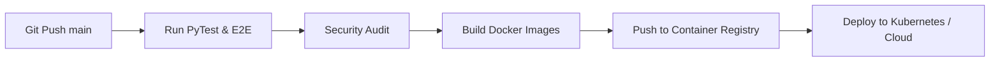

# Volume 10 – Deployment & Maintenance

> **ChessX Technical & Design Documentation**  
> **Document Version:** 1.0.0  
> **Status:** Approved Specification  

---

## 1. Automated CI/CD & Build Process

ChessX uses **GitHub Actions** for continuous integration and deployment automation.



---

## 2. Platform Build Pipelines

### 2.1 Web & Android Release Pipeline
- **Web App**: Static assets minified and bundle generated via Vite/Webpack, deployed to CDN (Cloudflare / AWS CloudFront).
- **Android Target**: Built using Capacitor / Flutter wrapper into Android Application Bundle (`.aab`) signed with production release keystore for Google Play Store upload.
- **iOS Target (Future Roadmap v2.0)**: Xcode build pipeline configured for TestFlight and App Store submission.

---

## 3. Backend Deployment Architecture

Backend services run containerized inside **Docker** containers managed by **Kubernetes** or **AWS ECS**:

```dockerfile
# Multi-stage Production Dockerfile
FROM python:3.11-slim AS builder
WORKDIR /app
COPY requirements.txt .
RUN pip install --no-cache-dir -r requirements.txt

FROM python:3.11-slim
WORKDIR /app
COPY --from=builder /usr/local/lib/python3.11/site-packages /usr/local/lib/python3.11/site-packages
COPY --from=builder /usr/local/bin /usr/local/bin
COPY . .
EXPOSE 8000
CMD ["uvicorn", "app.main:app", "--host", "0.0.0.0", "--port", "8000", "--workers", "4"]
```

---

## 4. Database Migrations & Backup Strategy

### 4.1 Alembic Migration Protocol
Database schema evolutions are managed using **Alembic**:
```bash
# Generate migration script
alembic revision --autogenerate -m "Add index to games table"
# Apply migrations zero-downtime
alembic upgrade head
```

### 4.2 Disaster Recovery & Backups
- **Automated Snapshots**: Daily full PostgreSQL database dumps stored in encrypted AWS S3 bucket with 30-day retention policy.
- **Point-in-Time Recovery (PITR)**: Write-Ahead Logging (WAL) archived every 5 minutes allowing database restoration to any second within 7 days.
- **Recovery Time Objective (RTO)**: < 30 minutes.
- **Recovery Point Objective (RPO)**: < 5 minutes.

---

## 5. Monitoring, Logging & Observability

- **Metrics Collection**: **Prometheus** scrapes application metrics (`/metrics` endpoint exposing HTTP latency, WebSocket connections count, Redis queue sizes, active matches).
- **Visualization Dashboards**: **Grafana** displays real-time server health, memory utilization, and active players online.
- **Centralized Logging**: Logs aggregated using **Loki** / **ELK Stack** with real-time Slack/PagerDuty alerts triggered on error spikes ($> 1\%$ 5xx HTTP responses over 5 mins).

---

## 6. Version Updates & Maintenance Strategy

- **Zero-Downtime Rolling Updates**: Kubernetes rolling update deployment strategy (`maxSurge: 25%`, `maxUnavailable: 0`) ensures zero dropped active matches during backend updates.
- **Graceful Shutdown**: Server nodes wait for active WebSocket matches to complete before terminating during node pool scale-down.

---

*End of Volume 10 – Deployment & Maintenance*
